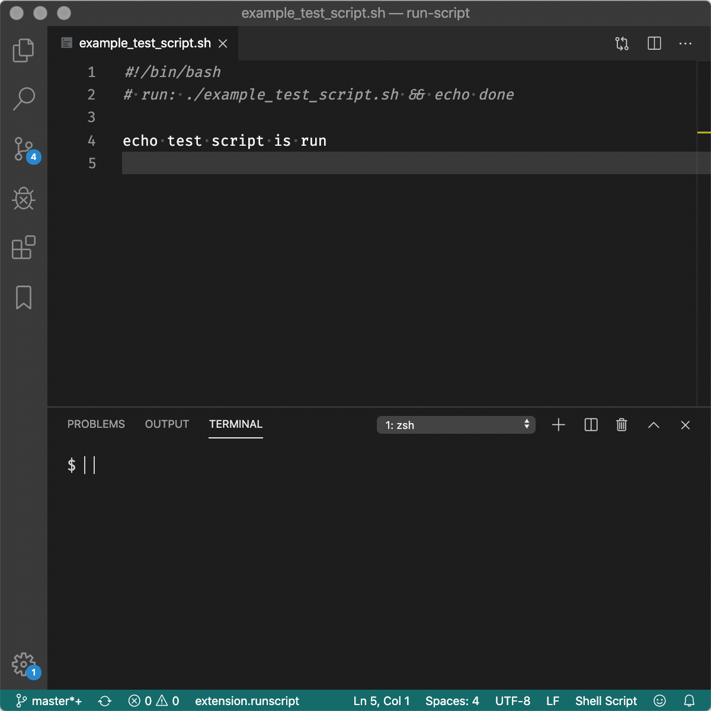

# run-script README

Run commands by declaring them as a comment in your file.

## Features

Searches for a command starting with `run:` in your source file and executes the command following:

```bash
#!/bin/bash
# run: ./this_script.sh

echo "this script was invoked by run-script"
```

This extension will send `./this_script.sh` as a command to your currently opened terminal:

```bash
$ ./this_script
this script was invoked by run-script
```



It runs a command in the current terminal. If there is no terminal it will open one. This is basically redundant to the VSCode launch settings but far quicker for easy script development.

## Configuration

You can configure if the default debugger is run when no `run:` statement was found in the current file. Use the property `runscript.startDebuggingWhenNoRunStatementFound` for this. Default is false.

Bind `extension.runscript` to a keybinding of your liking. I prefer `,s` together with the [Vim extension](http://aka.ms/vscodevim).

By default `ctrl l` or `cmd l` is bound to `run-script`.

I've edited my user settings with this entry as described [here](https://github.com/VSCodeVim/Vim#quick-example):

```json
        {
            "before": [
                "<Leader>",
                "s"
            ],
            "after": [],
            "commands": [
                {
                    "command": "extension.runscript",
                    "args": []
                }
            ]
        },
```

## Requirements

None
